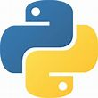
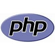
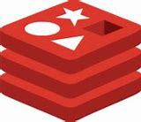
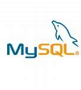

# Programação e Desenvolvimento Back-end.

> Repositório direcionado para fins acadêmicos, com explicações e exemplos citados no curso. Programação em C, Programação em Python, Banco de Dados e outros... Serão colocados aqui para prática e desenvolvimento das linguagens back-end.

       
